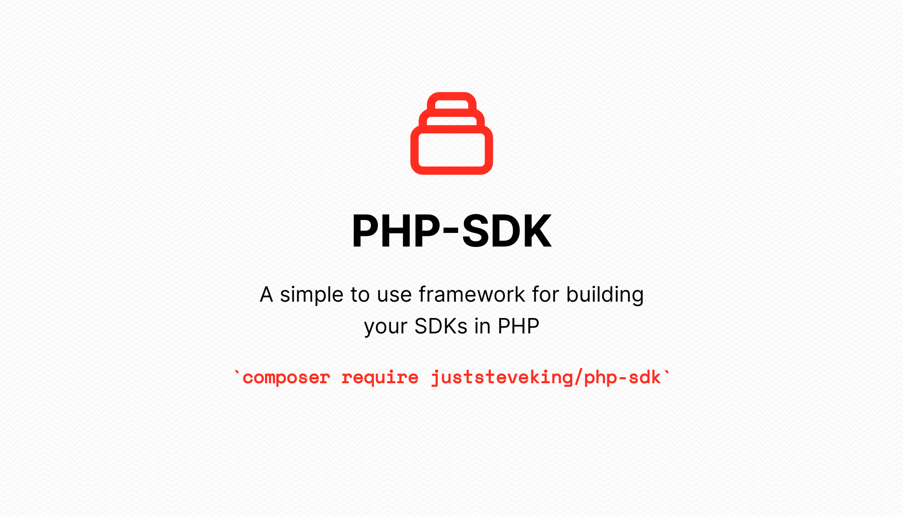

# PHP SDK

<p align="center">



</p>

<!-- BADGES_START -->
[![Latest Version][badge-release]][packagist]
[![PHP Version][badge-php]][php]


[![Total Downloads][badge-downloads]][downloads]

[badge-release]: https://img.shields.io/packagist/v/juststeveking/php-sdk.svg?style=flat-square&label=release
[badge-php]: https://img.shields.io/packagist/php-v/juststeveking/php-sdk.svg?style=flat-square
[badge-downloads]: https://img.shields.io/packagist/dt/juststeveking/php-sdk.svg?style=flat-square&colorB=mediumvioletred

[packagist]: https://packagist.org/packages/juststeveking/php-sdk
[php]: https://php.net
[downloads]: https://packagist.org/packages/juststeveking/php-sdk
<!-- BADGES_END -->

A base sdk for your PHP sdks.

## Purpose

The purpose of this package is to provide a consistent and interoperable way to build PHP SDKs to work with 3rd party APis.


## Usage

Working with this library is relatively simple, and an example can be found in the [demo](./demo) and [examples](./examples) directories.

The basic concept is that you will need to either provide, or pass through the core components for the SDK, these are:

- PSR-17 Request and Response Factory.
- PSR-7 Messages
- PSR-11 Container

Inside this library we are using a PSR-18 implementation allowing you to connect the pieces together under the hood and provide SDK functionality using a replaceable set of components.

I highly recommend either:

- [nyholm/psr7](https://github.com/Nyholm/psr7/)
- [slim/psr7](https://github.com/slimphp/Slim-Psr7)
- [symfony/http-client](https://github.com/symfony/http-client)
- [laminas/diactoros](https://github.com/laminas/laminas-diactoros)

To handle the Http PSRs as they are lightweight and designed to be simple and PSR compliant.


To begin with we want to create a `ClientBuilder` object which is our Domain Transfer Object which will be used to pass into our Clients constructor:

```php
use DI\Container;
use JustSteveKing\UriBuilder\Uri;
use JustSteveKing\HttpSlim\HttpClient;
use JustSteveKing\PhpSdk\ClientBuilder;
use Symfony\Component\HttpClient\Psr18Client;
use JustSteveKing\HttpAuth\Strategies\BasicStrategy;

$builder = new ClientBuilder(
    Uri::fromString('https://www.domain.com'),
    HttpClient::build(
        new Psr18Client(), // http client (psr-18)
        new Psr18Client(), // request factory (psr-17)
        new Psr18Client() // stream factory (psr-17)
    ),
    new BasicStrategy(
        base64_encode("username:password")
    ),
    new Container()
);
```

We can then pass this through to our implementation, or build this within your implementation to pass through to the parent constructor.

Then we simply need to register our resources that are available on our SDK:

```php
use JustSteveKing\PhpSdk\Resources\AbstractResource;

$sdk->addResource('ideas', new class extends AbstractResource {
    protected string $path = 'ideas';
});
```

The resource we just added will not be accessible by its key "ideas" to forward calls to the resource:

```php
$sdk->ideas->get();
```

Which will return a PSR-7 Response object, allowing you to use and convert this as required.

The available methods on resources are:

- `get()` return all resources
- `find($identifier)` return a single resource
- `create(array $data)` create a single resource
- `update($identifier, array $data, string $method = 'patch')` update a single resource with a method override
- `delete($identifier)` delete a single resource
- `where(string $key, $value)` add query parameters to your URI query.


It is highly recommended that you use these internally in your API to give you the ability to control the process.
