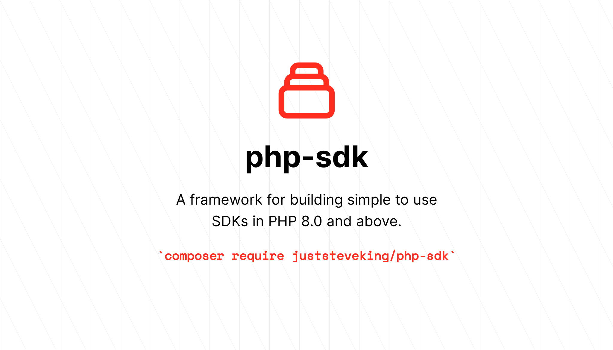

# PHP SDK

<p align="center">



</p>

<!-- BADGES_START -->
[![Latest Version][badge-release]][packagist]
[![PHP Version][badge-php]][php]

[![Total Downloads][badge-downloads]][downloads]

[badge-release]: https://img.shields.io/packagist/v/juststeveking/php-sdk.svg?style=flat-square&label=release
[badge-php]: https://img.shields.io/packagist/php-v/juststeveking/php-sdk.svg?style=flat-square
[badge-downloads]: https://img.shields.io/packagist/dt/juststeveking/php-sdk.svg?style=flat-square&colorB=mediumvioletred

[packagist]: https://packagist.org/packages/juststeveking/php-sdk
[php]: https://php.net
[downloads]: https://packagist.org/packages/juststeveking/php-sdk
<!-- BADGES_END -->

A framework for building simple to use SDKs in PHP 8.0 and above.

## Installation

```shell
composer require juststeveking/php-sdk
```

## Purpose

The purpose of this package is to provide a consistent and interoperable way to build PHP SDKs to work with 3rd party APis.

## Usage

Working with this library is relatively simple, and an example can be found in the [demo](./demo) and [examples](./examples) directories.

The basic concept is that you will need to provide:

- PSR-17 Request and Response Factory.
- PSR-7 Messages

Inside this library we are using a PSR-18 implementation allowing you to connect the pieces together under the hood and provide SDK functionality using a replaceable set of components.

I highly recommend either:

- [nyholm/psr7](https://github.com/Nyholm/psr7/)
- [slim/psr7](https://github.com/slimphp/Slim-Psr7)
- [symfony/http-client](https://github.com/symfony/http-client)
- [laminas/diactoros](https://github.com/laminas/laminas-diactoros)

To handle the Http PSRs as they are lightweight and designed to be simple and PSR compliant.

### Building the SDK

To begin with we need to be able to build our SDK, to do this we can either use the `constructor` or use the static `build` method.:

#### SDK constructor

To create an SDK instance; simply pass through a uri, a Http Client that uses auto-discovery to find the available PSR-18 client, an authentication strategy, and an instance of the `Container`.

```php
use JustSteveKing\HttpAuth\Strategies\BasicStrategy;
use JustSteveKing\HttpSlim\HttpClient;
use JustSteveKing\UriBuilder\Uri;
use JustSteveKing\PhpSdk\SDK;
use PHPFox\Container\Container;

$sdk = new SDK(
    uri: Uri::fromString('https://www.domain.com'),
    client: HttpClient::build(),
    strategy: new BasicStrategy(
        authString: base64_encode("username:password")
    ),
    container: Container::getInstance(),
);
```

#### SDK build

To use the static build method, the only requirement is to pass through a uri. If you want to set a custom Authentication Strategy you can also pass this through otherwise it will default to a Null Strategy.

```php
use JustSteveKing\UriBuilder\Uri;
use JustSteveKing\PhpSdk\SDK;

$sdk = SDK::build(
    uri: 'https://www.domain.com',
);
```

### Adding Resources to our SDK

Each Resource you add to your SDK requires 2 things:

- Implements `ResourceContract`
- Extends `AbstractResource`

Your resource should look like this:

```php
use JustSteveKing\PhpSdk\Contracts\ResourceContract;
use JustSteveKing\PhpSdk\Resources\AbstractResource;

class TestResource extends AbstractResource implements ResourceContract
{
    protected string $path = '/test';

    public static function name(): string
    {
        return 'tests';
    }
}

```

The Path property allows you to set the uri path for this resource, and the static name method is how this resource is stored on the container.

To add this resource to the SDK, you can use the add method:

```php
$sdk->add(
    name: TestResource::name(),
    resource: TestResource::class,
);
```

Internally this will add the resource onto container and inject the SDK into the constructor, allowing you to access the Http Client and other aspects of the SDK.

### Calling a Resource

Now that you have added a resource to the SDK, you are able to call it using the PHP magic __get method:

```php
$response = $sdk->tests->get();
```

This will return a nice PSR-7 response for you to work with inside your SDK code.

### API

The below documents the API of the PHP-SDK:

#### SDK class

Your own SDK class should extend the base SDK class for easier integration.

- `__construct(URI $uri, HttpClient $client, Container $container, null|StrategyInterface $strategy)` **The SDK constructor.**
- `static build(string $uri, null|StrategyInterface $strategy = null, null|Container = null): SDK` **This static build method allows the defaults to be set for you to get an SDK quickly.**
- `add(string $name, string $resource): self` **The add method allows you to add resources onto the SDK container, and checks that the resource being passed extends the AbstractResource and implements the ResourceContract.**
- `uri(): Uri` **Return the setup instance of UriBuilder that is being used, to allow you to manipulate the URI string.**
- `client(): HttpClient` **Return the setup instance of the HttpClient that is being used, to allow you to enforce any changes that are required.**
- `strategy(): StrategyInterface` **Returns the setup instance of the Authentication Strategy that is being used, to allow you to export the auth header array.**
- `container(): Container` **Returns the setup instance of the Container, to allow you to bind make and work with the container directly should it be required.**
- `__get(string $name): ResourceContract` **Returns a build instance of the called Resource if it has been added to the container.**

#### AbstractResource class

Your resources must all extend the Abstract Resource class.

- `__construct(SDK $sdk, null|string $path = null, string $authHeader = 'Bearer', array $with = [], array $relations = [], bool $strictRelations = false, null|string $load = null)` **The Resource constructor.**
- `sdk(): SDK` **Return the setup instance of the SDK that has been passed through to the resource.**
- `getWith(): array` **Return an array of relations to sideload onto the request.**
- `getLoad(): string|null` **Return a string or null if a specific resource identifier has been passed in.**
- `load(string|int $identifier): self` **The load method allows you to set a specific resource identifier to look for on an API.**
- `uri(Uri $uri): self` **The uri method allows you to completely override the URI Builder on the SDK.**
- `client(HttpClient $http): self` **The client method allows you to completely override the Http Client on the SDK.**
- `strategy(StrategyInterface $strategy): self` **The strategy method allows you to completely override the Authentication Strategy on the SDK.**
- `loadPath(): self` **Loads the path from the resource into to URI builder on the SDK.**
- `get(): ResponseInterface` **Performs a GET request to the resource path, to return a list of resources.**
- `find(string|int $identifier): ResponseInterface` **Performs a GET request to the resource path with an identifier appended to it, to return a single resource.**
- `create(array $data): ResponseInterface` **Performs a POST request to the resource path, to create a new single resource.**
- `update($identifier, array $data, string $method = 'patch'): ResponseInterface` **Performs either a PATCH or PUT request to the resource path with an identifier appended to it, to update a single resource.**
- `delete(string|int $identifier): ResponseInterface` **Performs a DELETE request to the resource path with an identifier appended to it, to remove a resource.**
- `where(string $key, $value): self` **Builds the query parameters in a famility query builder style syntax.**

#### ResourceContract Interface

Your resources must implement the ResourceContract interface.

- `static name(): string` **Returns a string representation of the resource name, to allow it to be bound the the SDK container.**


It is highly recommended that you use all of these internally in your API to give you the ability to control the process.

### Building an SDK

To build an SDK, you can simply extend the SDK like so:

```php
use Demo\Resources\Server;
use JustSteveKing\HttpAuth\Strategies\NullStrategy;
use JustSteveKing\HttpSlim\HttpClient;
use JustSteveKing\PhpSdk\SDK;
use JustSteveKing\UriBuilder\Uri;
use PHPFox\Container\Container;

class MySDK extends SDK
{
    public function __construct()
    {
        parent::__construct(
            uri: Uri::fromString(
                uri: 'https://www.domain.tld',
            ),
            client: HttpClient::build(),
            container: Container::getInstance(),
            strategy: new NullStrategy(),
        );
    }

    public static function boot(): MySDK
    {
        $client = new MySDK();

        $client->add(
            name: TestResource::name(),
            resource: TestResource::class,
        );

        return $client;
    }
}
```

## Testing

TO run the test:

```bash
composer run test
```

## Credits

- [Steve McDougall](https://github.com/JustSteveKing)
- [All Contributors](../../contributors)

## LICENSE

The MIT LIcense (MIT). Please see [License File](./LICENSE) for more information.
